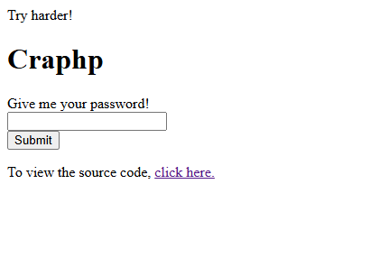

# nullcon: Crahp

**Categoria**: Web Exploitation\
**Dificuldade**: Facil (minha opiniao)

---

## Solução

### 1. Análise inicial
Ao abrir a pagina web, vemos apenas um input simples e um link que diz "To view the source code, **click here.**"



Ao acessar o **source code** da pagina podemos ver o codigo:

```
E5, 0xE2, 0xEB, 0xEC,
    0xC1, 0xC6, 0xCF, 0xC8, 0xDD, 0xDA, 0xD3, 0xD4,
    0x69, 0x6E, 0x67, 0x60, 0x75, 0x72, 0x7B, 0x7C,
    0x51, 0x56, 0x5F, 0x58, 0x4D, 0x4A, 0x43, 0x44,
    0x19, 0x1E, 0x17, 0x10, 0x05, 0x02, 0x0B, 0x0C,
    0x21, 0x26, 0x2F, 0x28, 0x3D, 0x3A, 0x33, 0x34,
    0x4E, 0x49, 0x40, 0x47, 0x52, 0x55, 0x5C, 0x5B,
    0x76, 0x71, 0x78, 0x7F, 0x6A, 0x6D, 0x64, 0x63,
    0x3E, 0x39, 0x30, 0x37, 0x22, 0x25, 0x2C, 0x2B,
    0x06, 0x01, 0x08, 0x0F, 0x1A, 0x1D, 0x14, 0x13,
    0xAE, 0xA9, 0xA0, 0xA7, 0xB2, 0xB5, 0xBC, 0xBB,
    0x96, 0x91, 0x98, 0x9F, 0x8A, 0x8D, 0x84, 0x83,
    0xDE, 0xD9, 0xD0, 0xD7, 0xC2, 0xC5, 0xCC, 0xCB,
    0xE6, 0xE1, 0xE8, 0xEF, 0xFA, 0xFD, 0xF4, 0xF3
];

    $byteArray = unpack('C*', $input);
    $len = count($byteArray);
    $crc = 0;
    for ($i = 1; $i <= $len; $i++) {
        $crc = $crc8Table[($crc ^ $byteArray[$i]) & 0xff];
    }
    return $crc & 0xff;
}

$MYPASSWORD = "AdM1nP@assW0rd!";
include "flag.php";

if(isset($_POST['password']) && strlen($MYPASSWORD) == strlen($_POST['password'])) {
    $pwhash1 = crc16($MYPASSWORD);
    $pwhash2 = crc8($MYPASSWORD);

    $password = $_POST['password'];
    $pwhash3 = crc16($password);
    $pwhash4 = crc8($password);

    if($MYPASSWORD == $password) {
        die("oops. Try harder!");
    }
    if($pwhash1 != $pwhash3) {
        die("Oops. Nope. Try harder!");
    }
    if($pwhash2 != $pwhash4) {
        die("OoOps. Not quite. Try harder!");
    }
    $access = true;
 
    if($access) {
        echo "You win a flag: $FLAG";
    } else {
        echo "Denied! :-(";
    }
} else {
    echo "Try harder!";
}
?>

<html>
    <head>
        <title>Craphp</title>
    </head>
    <body>
        <h1>Craphp</h1>
        <form action="/" method="post">
            <label for="password">Give me your password!</label><br>
            <input type="text" name="password"><br>
            <button type="submit">Submit</button>
        </form>
        <p>To view the source code, <a href="/?source">click here.</a>
    </body>
</html>
```

### 2. Engenharia Reversa no codigo

Ao visualizar o codigo eh possivel identificar ele pega nosso input e faz duas variaveis a partir dele, a  **pwhas3 e pwhash4**, que sao geradas a partir da criptografia [CRC16](https://fastercapital.com/content/All-You-Need-to-Know-About-CRC16--Detecting-Errors-in-Data-Transmission.html#:~:text=CRC16%20is%20a%20type%20of,a%20checksum%20to%20the%20packet.) e [CRC8](https://avrhelp.mcselec.com/index.html?crc8.html) respectivamente, logo precisamos colocar um input que **nao** seja "AdM1nP@assW0rd!" mas que ao passar pela criptografia tenham o mesmo resultado.

Para isso usei o seguinte codigo que faz um **BruteForce** com os caracteres ate achar um resultado que bata com as necessidades citadas acima:

```
import random
import string

# Função CRC16 (traduzida do PHP para Python)
def crc16(s):
    crc = 0xFFFF
    for char in s:
        crc ^= ord(char)
        for _ in range(8):
            if crc & 0x0001:
                crc = (crc >> 1) ^ 0xA001
            else:
                crc >>= 1
    return crc

# Função CRC8 (traduzida do PHP para Python)
def crc8(s):
    crc8_table = [
        0x00, 0x07, 0x0E, 0x09, 0x1C, 0x1B, 0x12, 0x15,
        0x38, 0x3F, 0x36, 0x31, 0x24, 0x23, 0x2A, 0x2D,
        0x70, 0x77, 0x7E, 0x79, 0x6C, 0x6B, 0x62, 0x65,
        0x48, 0x4F, 0x46, 0x41, 0x54, 0x53, 0x5A, 0x5D,
        0xE0, 0xE7, 0xEE, 0xE9, 0xFC, 0xFB, 0xF2, 0xF5,
        0xD8, 0xDF, 0xD6, 0xD1, 0xC4, 0xC3, 0xCA, 0xCD,
        0x90, 0x97, 0x9E, 0x99, 0x8C, 0x8B, 0x82, 0x85,
        0xA8, 0xAF, 0xA6, 0xA1, 0xB4, 0xB3, 0xBA, 0xBD,
        0xC7, 0xC0, 0xC9, 0xCE, 0xDB, 0xDC, 0xD5, 0xD2,
        0xFF, 0xF8, 0xF1, 0xF6, 0xE3, 0xE4, 0xED, 0xEA,
        0xB7, 0xB0, 0xB9, 0xBE, 0xAB, 0xAC, 0xA5, 0xA2,
        0x8F, 0x88, 0x81, 0x86, 0x93, 0x94, 0x9D, 0x9A,
        0x27, 0x20, 0x29, 0x2E, 0x3B, 0x3C, 0x35, 0x32,
        0x1F, 0x18, 0x11, 0x16, 0x03, 0x04, 0x0D, 0x0A,
        0x57, 0x50, 0x59, 0x5E, 0x4B, 0x4C, 0x45, 0x42,
        0x6F, 0x68, 0x61, 0x66, 0x73, 0x74, 0x7D, 0x7A,
        0x89, 0x8E, 0x87, 0x80, 0x95, 0x92, 0x9B, 0x9C,
        0xB1, 0xB6, 0xBF, 0xB8, 0xAD, 0xAA, 0xA3, 0xA4,
        0xF9, 0xFE, 0xF7, 0xF0, 0xE5, 0xE2, 0xEB, 0xEC,
        0xC1, 0xC6, 0xCF, 0xC8, 0xDD, 0xDA, 0xD3, 0xD4,
        0x69, 0x6E, 0x67, 0x60, 0x75, 0x72, 0x7B, 0x7C,
        0x51, 0x56, 0x5F, 0x58, 0x4D, 0x4A, 0x43, 0x44,
        0x19, 0x1E, 0x17, 0x10, 0x05, 0x02, 0x0B, 0x0C,
        0x21, 0x26, 0x2F, 0x28, 0x3D, 0x3A, 0x33, 0x34,
        0x4E, 0x49, 0x40, 0x47, 0x52, 0x55, 0x5C, 0x5B,
        0x76, 0x71, 0x78, 0x7F, 0x6A, 0x6D, 0x64, 0x63,
        0x3E, 0x39, 0x30, 0x37, 0x22, 0x25, 0x2C, 0x2B,
        0x06, 0x01, 0x08, 0x0F, 0x1A, 0x1D, 0x14, 0x13,
        0xAE, 0xA9, 0xA0, 0xA7, 0xB2, 0xB5, 0xBC, 0xBB,
        0x96, 0x91, 0x98, 0x9F, 0x8A, 0x8D, 0x84, 0x83,
        0xDE, 0xD9, 0xD0, 0xD7, 0xC2, 0xC5, 0xCC, 0xCB,
        0xE6, 0xE1, 0xE8, 0xEF, 0xFA, 0xFD, 0xF4, 0xF3
    ]
    crc = 0
    for char in s:
        crc = crc8_table[(crc ^ ord(char)) & 0xFF]
    return crc & 0xFF

# Senha original
MYPASSWORD = "AdM1nP@assW0rd!"

# Calcular os hashes da senha original
target_crc16 = crc16(MYPASSWORD)
target_crc8 = crc8(MYPASSWORD)

# Caracteres possíveis para gerar a senha
chars = string.ascii_letters + string.digits + "!@#$%^&*()-_=+{}[]|:;\"'<>,.?/~`"

# Função para gerar uma senha aleatória de 16 caracteres
def generate_password():
    return ''.join(random.choice(chars) for _ in range(15))

# Encontrar a colisão
found = False
attempts = 0

while not found:
    attempts += 1
    password = generate_password()
    if password == MYPASSWORD:
        continue  # Ignorar a senha original
    crc16_val = crc16(password)
    crc8_val = crc8(password)
    if crc16_val == target_crc16 and crc8_val == target_crc8:
        found = True
        print(f"Colisão encontrada após {attempts} tentativas!")
        print(f"Senha encontrada: {password}")
        print(f"CRC16: {crc16_val} (esperado: {target_crc16})")
        print(f"CRC8: {crc8_val} (esperado: {target_crc8})")
```


### 3. Flag

Por fim, ao deixar o codigo rodando por um tempo, ele me deu a seguinte string "**j(P$W%G:j<B<{3y**", peguei essa string e coloquei no input da pagina web e peguei a flag!!!

```
ENO{Cr4hP_CRC_Collison_1N_P@ssw0rds!}
```

---

## Autor da WriteUp

[Membro de Networking - leandrobalta](https://github.com/leandrobalta)