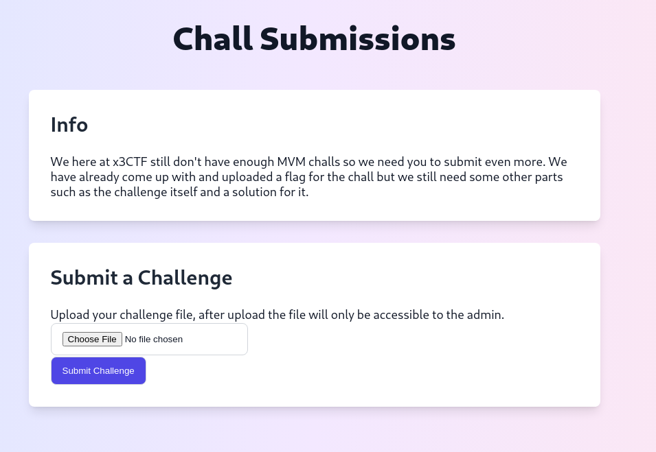

# Submission

*Could you help us out?*

- *Web Exploitation*
- *Autor do writeup: [@jackskelt](https://github.com/jackskelt)*

> Você pode acessar os arquivos do desafio no nosso repositório
> <https://github.com/HawkSecUnifei/Writeups>


O desafio consiste em uma vulnerabilidade de wildcard injection no comando `chmod`. Acessando a página inicial, vemos que temos um campo para fazer upload.



A flag está localizada dentro do diretório `/var/www/html/uploads`, podendo ser acessada usando `/uploads/flag.txt` na URL, porém nenhum usuário tem permissão de ler o arquivo.

```dockerfile
# Dockerfile:5
RUN chmod 000 /var/www/html/uploads/flag.txt
```

Analisando o código fornecido, temos a lógica por trás do upload.



```php
// src/index.php:67
<?php

if (isset($_FILES['file'])) {
$uploadOk = 1;
$target_dir = "/var/www/html/uploads/";
$target_file = $target_dir . basename($_FILES["file"]["name"]);

if (file_exists($target_file)) {
  echo "Sorry, file already exists.";
  $uploadOk = 0;
}
if ($_FILES["file"]["size"] > 50000) {
  echo "Sorry, your file is too large you need to buy Nitro.";
  $uploadOk = 0;
}
if (!str_ends_with($target_file, '.txt')) {
  echo "Due to exploit you can only upload files with .txt extensions sorry about this but we got hacked last time so we have to check this from now on.";
  $uploadOk = 0;
}
// Check if $uploadOk is set to 0 by an error
if ($uploadOk == 0) {
  echo "Sorry, your file was not uploaded.";
// if everything is ok, try to upload file
} else {
  if (move_uploaded_file($_FILES["file"]["tmp_name"], $target_file)) {
    echo "The file ". htmlspecialchars( basename( $_FILES["file"]["name"])). " has been uploaded.";
  } else {
    echo "Sorry, there was an error uploading your file.";
  }
}

$old_path = getcwd();
chdir($target_dir);
// make unreadable
shell_exec('chmod 000 *');
chdir($old_path);

}
?>
```



Vemos que somente arquivos que terminam com `.txt` podem ser enviados.



```php
// src/index.php:82
if (!str_ends_with($target_file, '.txt')) {
  echo "Due to exploit you can only upload files with .txt extensions sorry about this but we got hacked last time so we have to check this from now on.";
  $uploadOk = 0;
}
```



Após o arquivo ser salvo, vemos que ele roda o comando `chmod 000 *` dentro do diretório de uploads.



```php
// src/index.php:98
$old_path = getcwd();
chdir($target_dir);
// make unreadable
shell_exec('chmod 000 *');
chdir($old_path);
```



Percebemos que temos um wildcard no comando que é rodado. O `*` é interpretado pelo shell como uma "expressão regular" que corresponde nomes de arquivos com um ou mais caracteres. Se tivessemos a organização de arquivos abaixo e utilizasse o comando acima, ele poderia ser traduzido em `chmod 000 flag.txt arquivo1.txt arquivo2.txt`

```
uploads/
├── flag.txt
├── arquivo1.txt
└── arquivo2.txt
```

O comando [`chmod`](https://linux.die.net/man/1/chmod) tem algumas flags interessantes que podemos utilizar nesse caso. Uma delas é o `--reference`, onde é utilizado as permissões/modo de um arquivo como referencia para outros ao invés das permissões/modo explícitos.

Como o wildcard `*` não garante que o nome do arquivo que ele está passando é para ser interpretado como um arquivo, podemos usar isso para criar um arquivo em que o nome será interpretado como uma flag do comando, porém temos que ter algumas restrições em mente:

1. O arquivo para upload deve terminar com `.txt`, então não podemos enviar um arquivo `--reference=.`, para ele usar como referência as permissões do diretório atual.
2. O diretório raiz do comando é o `uploads` e o único arquivo presente é `flag.txt` o qual as permissões estão zeradas.
3. Não é possível utilizar `/` no nome de arquivos em sistemas UNIX, logo não podemos voltar de diretório com `../`.

Então o que podemos fazer é usar o `--reference` para um arquivo que vai ser adicionado posteriormente, já que o arquivo é adicionado com as permissões de leitura e escrida. Então criamos e enviamos um arquivo `--reference=dummy.txt`, ele vai ser interpretado pelo comando como flag, porém um erro irá ocorrer pois não existe nenhum arquivo `dummy.txt`. Após isso, enviamos o arquivo `dummy.txt`, que começa com as permissões de forma padrão. O comando após o envio poderia ser traduzido em `chmod 000 flag.txt --reference=dummy.txt dummy.txt`, com ele tentando mudar a permissão dos arquivos `000` (que não existe), `flag.txt` e `dummy.txt` para a permissão do arquivo `dummy.txt`.

Após isso, podemos acessar `/uploads/flag.txt` e obter a flag.

```
x3c{4lw4y5_chm0d_y0ur3_f1l35_4_53cur17y}
```